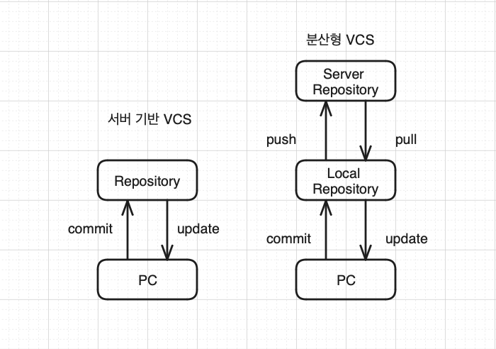

# 형상관리 시스템 VCS

## VCS란?

- 각종 문서 및 개발 소스 버전 제어 및 변경 관리 시스템
  - 변경 사항을 바이너리 데이터 형태로 관리
- 형상관리 시스템, 협업관리 시스템이라고도 함

> ### 바이너리 데이터 형태란❔
>
> 컴퓨터가 정보를 저장하고 처리하는 기본 형식

> ### 바이너리 파일이란?
>
> 사용자 또는 프로그램이 사용하던 정보나 숫자 값을 특별한 가공 없이 그대로 파일에 저장
>
> - 바이너리 파일 종류
>   - jpg, png ... mp3, exe

- VCS를 사용하는 이유

  1. 개발 소스 버전 및 변경 관리
  2. 백업 관리
  3. 협업 개발
  4. 개발소스 배포 자동화 관리

- 서버에 소스코드를 배포하는 이유

  1. 개발환경 분리
  2. 효율적인 전비
  3. 보안

- 배포
  - CD 지속적인 배포 => 개발한 소스코드를 자동으로 서버에 배포하는 것
  - CI 지속적인 통합 => VCS를 통해, 개발자가 개발한 소스를 통합해주는 것

---

## VCS 종류

- Git

  - 전세계적으로 가장 많이 되는 무료 오픈 소스 VCS
  - 로컬 저장소와 서버 저장소를 모두 제공하는 분산 저장소 모델 제공
  - 소스 제어 속도가 빠르고 효율적이며 성능이 좋다
    - **왜 Git을 제일 많이 사용하는가?** (SVN & CVS vs Git)
      - Git은 저장소가 두개로 분산되어있다.
        - 전통적인 저장소들은 서버 저장소만 존재했다.
          - 인터넷이 없으면 전통적인 저장소들을 사용할 수 없었다.

- CVS -> SVN

  - 클라이언트 서버 기반 오픈소스 무료 VCS 시스템

- TFS
  - 상용 ALM Tool
    - VCS가 반드시 있어야함
  - 관리할 수 있는 모든 개발 방법론들을 관리할 수 있음

---

### 서버기반 VCS vs 분산형 VCS

> ### 시나리오
>
> 출근 -> `pull`서버에 저장된 내용 가져오기  
> 퇴근 전 작업한 코드가 이상이 없다면, `commit`한 코드를 `push`한다.

---

## Git 주요 개념

---

- `.gitignore` 관리 대상 제외 폴더 및 파일 정의

- `git config` 로컬 저장소에 커밋을 위한, 사용자 계정 설정 설정

- `git init` 로컬 저장소 생성

- `git add .` 작업 내역을 스테이징 하는 명령어

- `git commit` 로컬 저장소에 확정 반영한다.
