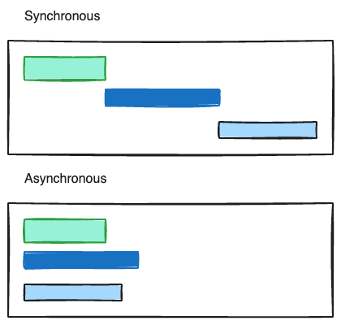

# 동기/ 비동기 개념

## 동기(Sync)란?

- 여러 작업을 처리함에 있어 직렬적으로 순차적으로 처리하는 방식

## 비동기(Async)란

- 여러 작업을 처리함에 있어 병렬적으로 동시에 처리 가능한 방식을 말한다.

> 

## 동기와 비동기의 차이

    - 처리방식이 병렬인가 직렬인가에 대한 차이가 있다.

    - 비동기방식은 처리에 우선순위가 없지만, 동기방식은 우선순위가 있다.
